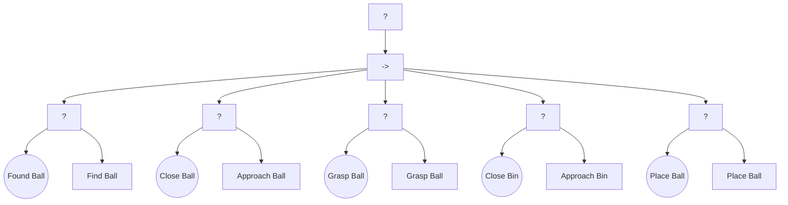

# Complex Pick Demo

This is a complex demo of a behavior tree that grasp and place a ball in a bin.

```mermaid
graph TD
    root[?] --> seq["->"]
    seq --> f1[?]
    seq --> f2[?]
    seq --> f3[?]
    seq --> f4[?]
    seq --> f5[?]
    f1 --> found_ball((Found Ball))
    f1 --> find_ball[Find Ball]
    f2 --> close_ball((Close Ball))
    f2 --> approach_ball[Approach Ball]
    f3 --> grasped_ball((Grasp Ball))
    f3 --> grasp_ball[Grasp Ball]
    f4 --> close_bin((Close Bin))
    f4 --> approach_bin[Approach Bin]
    f5 --> placed_ball((Place Ball))
    f5 --> place_ball[Place Ball]
```

