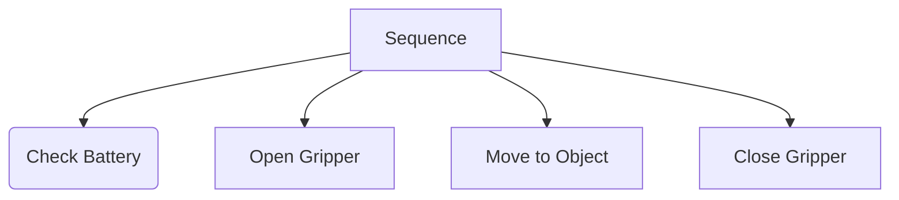

# Simple Pick Demo

This is a simple demo of a behavior tree that picks up an object.

```mermaid
graph TD
    seq[Sequence] --> check_battery(Check Battery)
    seq --> open_gripper[Open Gripper]
    seq --> move_to_obj[Move to Object]
    seq --> close_gripper[Close Gripper]
```

